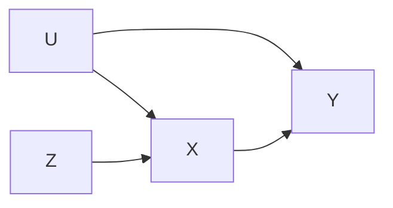

# Markdown notes in VSCode

Mardown example in VSCode with Markdown Preview Enhanced and Mermaid.

## My beautiful equation

$$
\begin{aligned}
 AR(p): Y_t &= c + \sum_{i=1}^p \phi_i Y_{t-i} + \epsilon_t \\
 \text{where } \epsilon & \sim N(0,1) \text{ iid}. 
\end{aligned}
$$

*Note: There is a graph that goes with it!*

